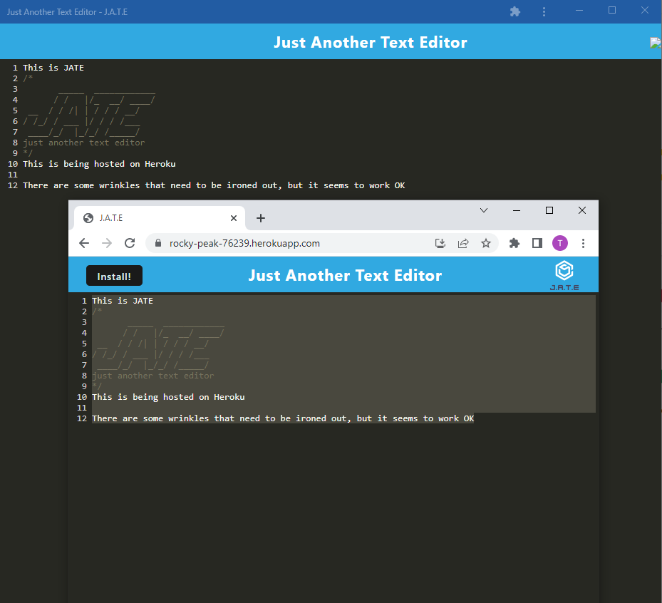

[](https://opensource.org/licenses/MIT)
# Table of Contents

[Description](#Description)

[Installation](#Installation)

[Usage](#Usage)

[Contributing](#Contributing)

[Questions](#Questions)

# Description
```
A text editor that runs in-browser and works offline
```
- Can be downloaded as an installable app that runs in browser
- Uses service-workers, works offline
# Installation
```
If you don't already have node.js, install node.js
If you don't already have mysql installed, this also must be installed
Navigate to the project directory via a command line interface such as bash, powershell, or zshell
```
```
Use the command 'npm install' to install dependencies from the package.json
```
# Usage
```
Use a command line interface to navigate to the project folder
To start the application, run the command 'npm start'
Test the application's ability using your browser, navigate to localhost:3000 to see the app
```
You can also see the app live hosted on Heroku here: [jate on heroku](https://rocky-peak-76239.herokuapp.com/)

# Contributing
If you would like to contribute to the project, it can be found here: [jate](https://github.com/tperschon/jate)
# Questions
If you have any questions, I can be reached via: [Github](github.com/tperschon) and [E-Mail](timperschon@gmail.com)
